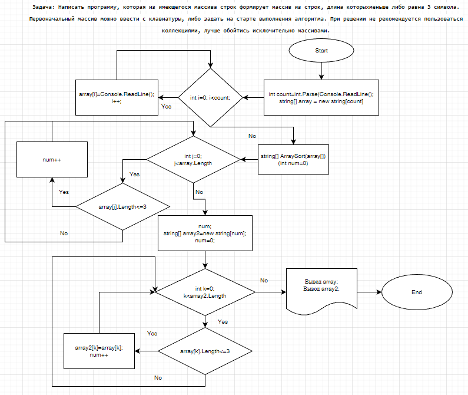

### Задача: Написать программу, которая из имеющегося массива строк формирует массив из строк, длина которыхменьше либо равна 3 символа. Первоначальный массив можно ввести с клавиатуры, либо задать на старте выполнения алгоритма. При решении не рекомендуется пользоваться коллекциями, лучше обойтись исключительно массивами.

*Порядок решения задачи:*
+ Через команду  *int count = int.Parse(Console.ReadLine()!)* задаем количество элементов первичного массива, далее инициализируем первиный массив *string[] array = new string[count]* и через цикл *for* и *Console.ReadLine()!* заполнем его с клавиатуры произвольными строками;
+ Создается метод *string[] ArraySort(string[] arr)* в котором прооизводится через цикл *for* и ветвления *if* проверка элементов массива аргумента на предмет соответствия условию *arr[j].Length <=3* с последующим приращением счетчика *int num*. Далее инциализируется второй одномерный массив *string[] array2 = new string[num]* с количеством элементов *num* и через цикл *for* и ветвления *if* производится заполнение второго массива строками первого, удовлетворяющими условию задачи *arr[j].Length <=3*;
+ На последнем этапе выводится в терминал первичный массив *Console.WriteLine(String.Join(" | ", array))* , пустая строка разделитель *Console.WriteLine()* и вывод массива согласно условию задачи через метод *Console.WriteLine(String.Join(" | ", ArraySort(array)))*. 

### Блок-схема решения задачи:

